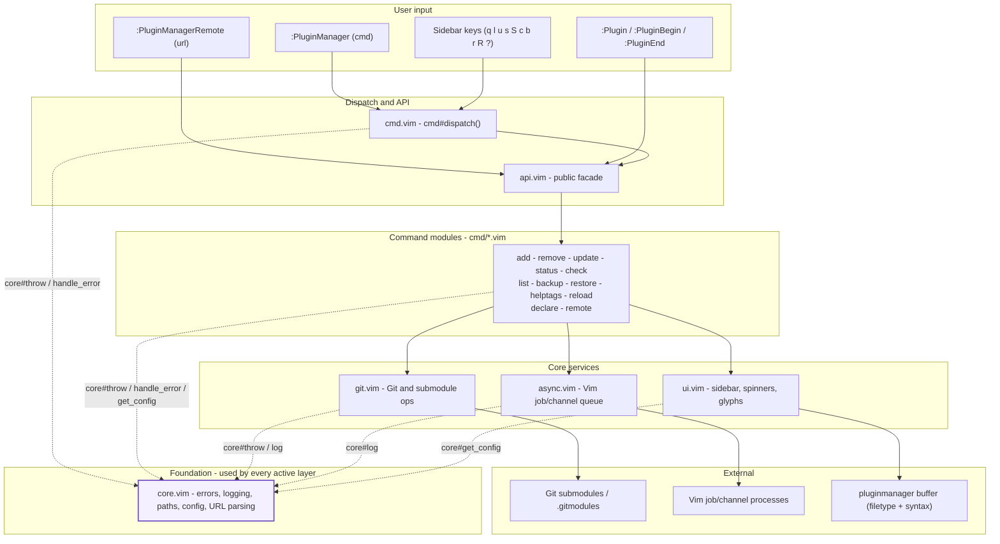
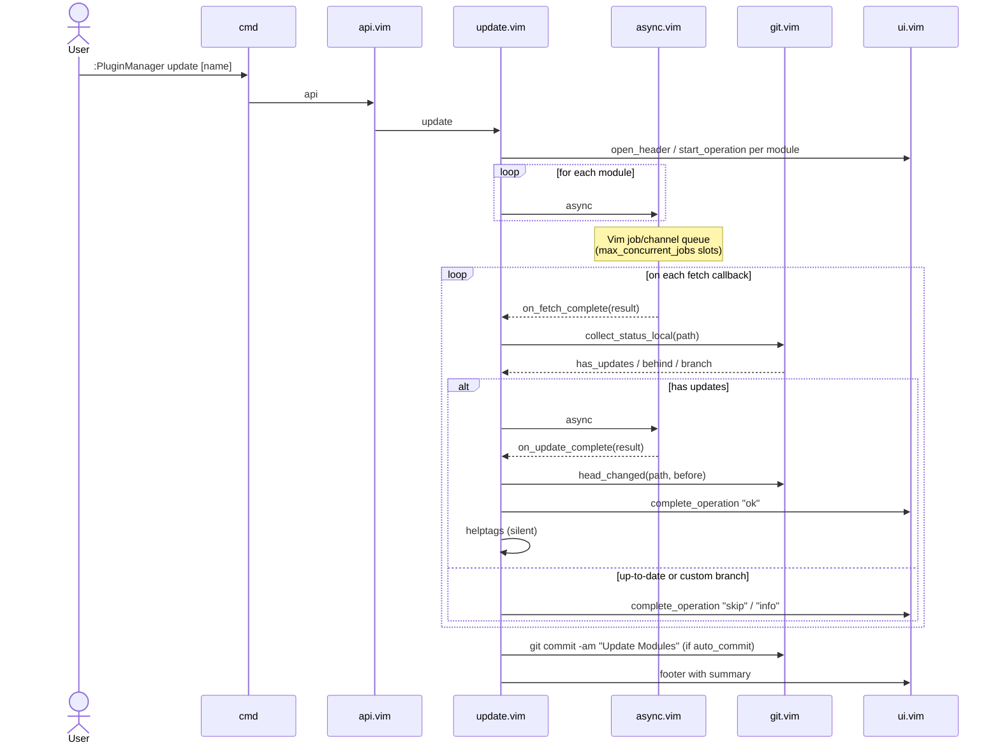

# Contributing to Vim Plugin Manager

Thank you for considering contributing to the Vim Plugin Manager project! This document outlines the process for contributing to this project and helps ensure a smooth collaboration experience.

## Table of Contents

- [Code of Conduct](#code-of-conduct)
- [Getting Started](#getting-started)
- [Development Workflow](#development-workflow)
- [Pull Request Process](#pull-request-process)
- [Coding Standards](#coding-standards)
- [Architecture Overview](#architecture-overview)
- [Testing](#testing)
- [Documentation](#documentation)
- [Issue Reporting](#issue-reporting)

## Code of Conduct

This project adheres to a code of conduct that expects all participants to be respectful, inclusive, and considerate. By participating, you are expected to uphold this code. Please report unacceptable behavior to [gke@6admin.io](mailto:gke@6admin.io).

## Getting Started

1. **Fork the repository** on GitHub.
2. **Clone your fork** locally:
   ```bash
   git clone https://github.com/yourusername/vim-plugin-manager.git
   cd vim-plugin-manager
   ```
3. **Add the upstream repository** as a remote:
   ```bash
   git remote add upstream https://github.com/username/vim-plugin-manager.git
   ```
4. **Create a branch** for your work:
   ```bash
   git checkout -b feature/your-feature-name
   ```

## Development Workflow

The project uses a simplified workflow. There is no `develop` branch. All
changes branch from and merge into `main`:

- `main`: stable code, tagged `vX.Y.Z` for releases.
- `feature/*`, `fix/*`, `chore/*`: task branches, branched from `main`.
- `hotfix/*`: urgent fixes on the current release, branched from `main`.

All merges use `--no-ff` to preserve branch topology.

To contribute a change:

1. Ensure you're working on the latest `main`:
   ```bash
   git fetch upstream
   git rebase upstream/main
   ```

2. Create a branch for your work:
   ```bash
   git checkout -b feature/your-feature-name main
   ```

3. Make your changes, following the [coding standards](#coding-standards).

4. Test your changes (see [Testing](#testing)).

5. Commit your changes with a descriptive message following
   [Conventional Commits](https://www.conventionalcommits.org/):
   ```bash
   git commit -m "feat: add support for XYZ"
   git commit -m "fix(core): implement missing s:check_log_rotation function"
   ```
   
   Format: `type(scope): subject` (scope is optional).
   
   Valid types:
   - `feat:` new features (prefer over the historical `feature:`)
   - `fix:` bug fixes
   - `docs:` documentation changes
   - `test:` test additions or changes
   - `refactor:` code refactoring
   - `style:` formatting changes
   - `chore:` routine maintenance
   - `ci:` CI/CD workflow changes
   - `build:` build system or dependency changes
   
   Recommended scopes: `core`, `async`, `ui`, `git`, `cmd`, `api`, `github`, `gitlab`, `deps`.

6. Push your branch to your fork:
   ```bash
   git push origin feature/your-feature-name
   ```

7. Create a [pull request](#pull-request-process).

## Releases

Releases are automated via `.github/workflows/release.yml`:

1. Update version headers in all source files:
   ```bash
   make update-version VERSION=x.y.z
   ```
2. Update `CHANGELOG.md` with notes for the new version.
3. Commit and push to `main`:
   ```bash
   git commit -m "chore: bump to vx.y.z"
   git push
   ```
4. Tag the release and push the tag:
   ```bash
   git tag vX.Y.Z
   git push origin vX.Y.Z
   ```
   Pushing a `vX.Y.Z` tag to GitHub triggers the release workflow, which
   builds `vim-plugin-manager-vX.Y.Z.tar.gz` via `make archive` and publishes a
   GitHub Release with the asset and auto-generated release notes.

## Pull Request Process

1. Fill out the pull request template completely.
2. Link any relevant issues using GitHub keywords (e.g., "Fixes #123").
3. Ensure your PR passes all tests and CI checks.
4. Request a review from a maintainer.
5. Be responsive to feedback and make necessary changes.
6. Once approved, a maintainer will merge your PR.

## Coding Standards

- Follow existing code style and structure.
- For Vimscript:
  - Use 2-space indentation.
  - Keep lines under 100 characters when possible.
  - Use snake_case for functions and variables.
  - Prefix internal functions with `s:`.
  - Prefix plugin-specific functions with `plugin_manager#`.
  - Document functions with comments.
  - Use Vim script's native idioms.

## Architecture Overview

The plugin is designed using a modular architecture that follows the principles of separation of concerns and single responsibility. Understanding this architecture will help you contribute effectively.

### Core Components

The project is organized into several key components:

1. **Plugin Entry Point**
   - `plugin/plugin_manager.vim`: Defines commands, initializes global variables, and provides the main entry point function.

2. **Command Dispatcher**
   - `autoload/plugin_manager/cmd.vim`: Parses command arguments and dispatches to specialized command modules.

3. **Public API Façade**
   - `autoload/plugin_manager/api.vim`: Provides a unified API for all plugin operations.

4. **Core Functionality**
   - `autoload/plugin_manager/core.vim`: Contains fundamental utilities, error handling, path management and configuration functions.
   - `autoload/plugin_manager/git.vim`: Abstracts all Git operations and submodule management.
   - `autoload/plugin_manager/async.vim`: Provides non-blocking async operations using Vim's job/channel API.
   - `autoload/plugin_manager/ui.vim`: Handles user interface, sidebar rendering, and progress indication.

5. **Command Modules**
   - `autoload/plugin_manager/cmd/*.vim`: Contains implementation of specific commands:
     - `add.vim`: Plugin installation logic.
     - `remove.vim`: Plugin removal operations.
     - `list.vim`: Plugin listing and status reporting.
     - `update.vim`: Plugin update operations.
     - `backup.vim`: Configuration backup operations.
     - `restore.vim`: Plugin restoration operations.
     - `helptags.vim`: Helptags generation.
     - `reload.vim`: Plugin reloading operations.
     - `status.vim`: Plugin status reporting.
     - `declare.vim`: Declarative plugin configuration.
     - `remote.vim`: Remote repository management.

6. **Utility Files**
   - `ftdetect/pluginmanager.vim`: Defines filetype detection rules.
   - `ftplugin/pluginmanager.vim`: Sets buffer configuration and key mappings.
   - `syntax/pluginmanager.vim`: Defines syntax highlighting for the plugin interface.

### Control Flow

#### Static architecture



Dotted arrows indicate dependency on `core.vim` utilities; every module uses
them but they are not part of the primary data flow.

`:PluginManagerRemote` bypasses the dispatcher and calls `api#add_remote`
directly - it is a dedicated command, not a sub-command of `:PluginManager`.

#### Dynamic flow: `:PluginManager update` (async path)



1. User commands are processed through `:PluginManager` which calls `plugin_manager#cmd#dispatch()`.
2. The dispatcher parses arguments and routes to the appropriate command module.
3. Command modules implement specific operations using the core functionality.
4. UI feedback is provided through the UI module.
5. Git operations are abstracted through the Git module.
6. Asynchronous operations are handled through the Async module.

### Error Handling

Errors follow a structured, 4-field format:
- `PM_ERROR:component:CODE:message` for internal errors, where `CODE` is one of
  the component-specific codes defined in `s:error_types` in `core.vim`.
- Raise errors with `plugin_manager#core#throw(component, code, message)` rather
  than a bare `throw 'PM_ERROR:...'`.
- Catch and present them with `plugin_manager#core#handle_error(v:exception, component)`.
- The Core module provides utilities for creating, handling, and formatting errors.
- UI error display is handled through the UI module.

### Extending the Plugin

When adding new features:

1. **Determine the Appropriate Module**: New functionality should be placed in the most relevant module, or create a new one if needed.
2. **Follow the API Pattern**: 
   - Internal functions should be prefixed with `s:`.
   - Public functions should follow the naming pattern `plugin_manager#modulename#functionname()`.
3. **Use Core Utilities**: Leverage existing utilities from the Core, Git, UI, and Async modules.
4. **Add Command Implementation**: Place new commands in the cmd/ directory.
5. **Update API**: Add API functions to api.vim for new commands.
6. **Add Documentation**: Update help docs and README.md with new functionality.
7. **Update Command Handling**: Update the command dispatcher in cmd.vim.

### Configuration System

The plugin uses global configuration variables defined in `plugin/plugin_manager.vim`, and accessed via `plugin_manager#core#get_config()`:

- `g:plugin_manager_vim_dir`: Base directory for Vim configuration.
- `g:plugin_manager_plugins_dir`: Directory for storing plugins.
- `g:plugin_manager_start_dir`: Directory for auto-loaded plugins.
- `g:plugin_manager_opt_dir`: Directory for optional (lazy-loaded) plugins.
- `g:plugin_manager_vimrc_path`: Path to vimrc file.
- `g:plugin_manager_sidebar_width`: Width of the sidebar UI.
- `g:plugin_manager_default_git_host`: Default Git host for short plugin names.
- `g:plugin_manager_fancy_ui`: Controls whether to use Unicode symbols in the UI.
- `g:plugin_manager_enable_logging`: Enable/disable error logging.
- `g:plugin_manager_max_log_size`: Maximum log file size before rotation.
- `g:plugin_manager_log_history_count`: Number of log files to keep in rotation.
- `g:plugin_manager_spinner_style`: Style for spinners in async operations.
- `g:plugin_manager_pull_strategy`: Git pull strategy for updates (`ff-only`, `merge`, `rebase`).
- `g:plugin_manager_auto_commit_on_update`: Auto commit after successful updates.
- `g:plugin_manager_max_concurrent_jobs`: Maximum concurrent async jobs.
- `g:plugin_manager_job_timeout`: Default timeout (seconds) for async jobs.
- `g:plugin_manager_debug_mode`: Enable additional debug information.
- `g:plugin_manager_trace_commands`: Log all git commands to the debug log.
- `g:plugin_manager_check_on_startup`: Check for plugin updates on `VimEnter` (opt-in, default off).
- `g:plugin_manager_check_interval`: Hours between background update checks (cache TTL).
- `g:plugin_manager_auto_update`: Auto-install available updates on startup (opt-in, default off).

When adding new configuration options, follow this pattern and provide sensible defaults.

## Testing

The project uses [Vader](https://github.com/junegunn/vader.vim) for automated
tests, run in CI on both GitHub Actions (`.github/workflows/test.yml`) and
GitLab CI (`.gitlab-ci.yml`).

Run the suite locally:

```bash
git clone https://github.com/junegunn/vader.vim.git

# Interactive (local, with TUI)
make -f Makefile.test VADER=./vader.vim test

# Headless (same output as CI, clean plain text)
make -f Makefile.test VADER=./vader.vim test-ci
```

The `test` target runs `vim -Nu .vaderrc.vim -c 'Vader! tests/*.vader'`
(interactive terminal). The `test-ci` target runs the same via `vim -es`
(headless/ex mode) and produces clean plain-text output. Clean artifacts with
`make -f Makefile.test clean`.

When adding new features or fixing bugs:

1. Add or update Vader tests under `tests/`. Prefer tests that do not require
   network access (mock with local fixtures).
2. Verify your changes work correctly in Vim 8.2+ (Neovim is not supported).
3. Test all related functionality to ensure no regressions.
4. Ensure the suite passes (`make -f Makefile.test test-ci`) before opening a PR.

## Documentation

- Update documentation for any changed functionality.
- Document new features in:
  - The README.md file
  - The plugin's help documentation (doc/plugin_manager.txt)
  - Code comments for functions

Documentation should be clear, concise, and include examples where appropriate.

## Issue Reporting

When reporting issues, please include:

1. A clear and descriptive title.
2. Steps to reproduce the issue.
3. Expected and actual behavior.
4. Vim version and OS information.
5. Relevant error messages or screenshots.
6. Any relevant configuration or setup.

Feature requests should include:
1. A clear description of the problem the feature would solve.
2. Any proposed solutions or implementation details.

## Project Structure

Understanding the project's complete structure will help you contribute effectively:

```
.
├── autoload/
│   └── plugin_manager/
│       ├── api.vim                  # Public API facade
│       ├── async.vim                # Non-blocking job queue (Vim job/channel)
│       ├── cmd.vim                  # Command dispatcher and completion
│       ├── core.vim                 # Errors, logging, paths, config, URL parsing
│       ├── git.vim                  # Git and submodule operations
│       ├── ui.vim                   # Sidebar rendering, spinners, glyphs
│       └── cmd/                     # Command implementations
│           ├── add.vim              # Plugin installation
│           ├── backup.vim           # Configuration backup
│           ├── check.vim            # Update detection and notifications
│           ├── declare.vim          # Declarative plugin configuration
│           ├── helptags.vim         # Help tag generation
│           ├── list.vim             # Plugin listing
│           ├── reload.vim           # Plugin reload
│           ├── remote.vim           # Remote repository management
│           ├── remove.vim           # Plugin removal
│           ├── restore.vim          # Plugin restoration from .gitmodules
│           ├── status.vim           # Plugin status reporting
│           └── update.vim           # Plugin update
├── doc/                             # Vim help documentation
│   └── plugin_manager.txt           # :help plugin-manager
├── ftdetect/                        # Filetype detection
│   └── pluginmanager.vim            # Registers the pluginmanager filetype
├── ftplugin/                        # Filetype plugin
│   └── pluginmanager.vim            # Buffer settings and key mappings
├── plugin/                          # Plugin entry point
│   └── plugin_manager.vim           # Config defaults and command definitions
├── syntax/                          # Syntax highlighting
│   └── pluginmanager.vim            # Sidebar syntax highlighting
├── tests/                           # Vader test suite
│   ├── async.vader                  # Async jobs: shell_argv, queue, sync fallback
│   ├── backup.vader                 # Backup: commit and push to remote
│   ├── basic.vader                  # Plugin load, commands, default config
│   ├── cache.vader                  # Update-check cache read/write/TTL
│   ├── check.vader                  # Update detection and silent mode
│   ├── core.vader                   # Core: URL parsing, options, errors
│   ├── declare.vader                # Declarative Plugin/Begin/End blocks
│   ├── dispatch.vader               # Command dispatch and tab completion
│   ├── gitmodules.vader             # .gitmodules parsing and module lookup
│   ├── remove.vader                 # Plugin removal and ambiguity guard
│   ├── restore.vader                # Submodule restoration from .gitmodules
│   ├── status.vader                 # Status block rendering
│   ├── ui.vader                     # Sidebar rendering, operations, glyphs
│   └── update.vader                 # Update flows and stash safety
├── .github/workflows/test.yml       # GitHub Actions CI
├── .gitlab-ci.yml                   # GitLab CI
├── AGENTS.md                        # Guidance for AI agents and tooling
├── CHANGELOG.md                     # History of changes and versions
├── CONTRIBUTING.md                  # Contribution guidelines (this file)
├── LICENSE                          # MIT license
├── Makefile                         # Build and version management
├── Makefile.test                    # Vader test runner
└── README.md                        # Project overview and usage
```

## License

By contributing to this project, you agree that your contributions will be licensed under the same [MIT License](LICENSE) that covers the project.

---

Thank you for contributing to Vim Plugin Manager! Your efforts help make this project better for everyone.