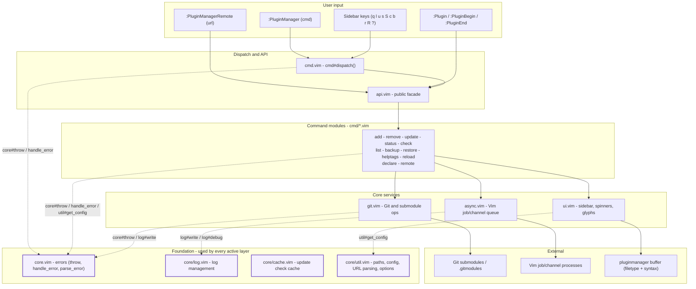
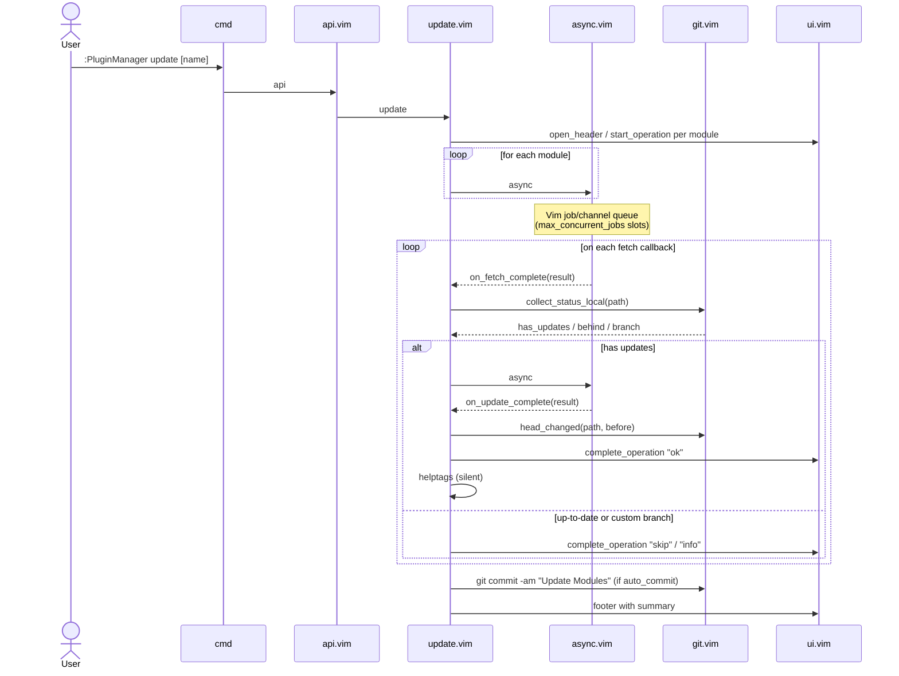

# Contributing to Vim Plugin Manager

Thank you for considering contributing to the Vim Plugin Manager project! This document outlines the process for contributing to this project and helps ensure a smooth collaboration experience.

## Table of Contents

- [Code of Conduct](#code-of-conduct)
- [Getting Started](#getting-started)
- [Development Workflow](#development-workflow)
- [Pull Request Process](#pull-request-process)
- [Coding Standards](#coding-standards)
- [Architecture Overview](#architecture-overview)
- [Testing](#testing)
- [Documentation](#documentation)
- [Issue Reporting](#issue-reporting)

## Code of Conduct

This project adheres to a code of conduct that expects all participants to be respectful, inclusive, and considerate. By participating, you are expected to uphold this code. Please report unacceptable behavior to [gke@6admin.io](mailto:gke@6admin.io).

## Supported platforms and Vim version floor

The project targets **Linux only** (Debian, Ubuntu, Arch, Gentoo,
RHEL/AlmaLinux/Rocky). Windows and macOS are not supported.

The minimum Vim version is **8.2** (with `+job` and `+channel`). This floor
is set by RHEL 9 / AlmaLinux 9 / Rocky 9, which ship Vim 8.2.2637, and will
not be raised without a concrete reason. The codebase uses no Vim 9.0+
features; a vim9script migration is explicitly deferred (dominant cost is
git/network I/O, not script execution). Do not change the guard
`if v:version < 802` in `plugin/plugin_manager.vim`.

## Getting Started

1. **Fork the repository** on GitHub.
2. **Clone your fork** locally:
   ```bash
   git clone https://github.com/yourusername/vim-plugin-manager.git
   cd vim-plugin-manager
   ```
3. **Add the upstream repository** as a remote:
   ```bash
   git remote add upstream https://github.com/username/vim-plugin-manager.git
   ```
4. **Create a branch** for your work:
   ```bash
   git checkout -b feature/your-feature-name
   ```

## Development Workflow

The project uses **GitHub Flow + tags**: a single protected branch (`main`)
and release tags. There is no `develop` branch and no maintenance branches
(`vX.Y`): fixes always target the current release.

- `main`: stable code, protected by a ruleset (required CI checks, no force
  push, conversations must be resolved). Maintainers bypass this protection.
- External contributors open pull requests from their fork.
- Maintainers work on local `feature/*`, `fix/*`, `chore/*`, `hotfix/*`
  branches and merge them with `--no-ff` to preserve branch topology.
- Releases are tags on `main` (`vX.Y.Z`), see [Releases](#releases).

### External contributors (fork + PR)

1. **Fork the repository** on GitHub, clone your fork and add upstream:
   ```bash
   git clone https://github.com/yourusername/vim-plugin-manager.git
   cd vim-plugin-manager
   git remote add upstream https://github.com/log0u7/vim-plugin-manager.git
   ```
2. **Branch from the latest upstream `main`** (one branch per topic, no
   long-lived branches):
   ```bash
   git fetch upstream
   git checkout -b fix/my-bug upstream/main    # or feature/... docs/... chore/...
   ```
3. Make your changes, following the [coding standards](#coding-standards)
   and the [TDD](#test-first-tdd) guidance.
4. Test your changes (see [Testing](#testing)).
5. Commit with [Conventional Commits](https://www.conventionalcommits.org/):
   ```bash
   git commit -m "feat: add support for XYZ"
   ```
   Format: `type(scope): subject` (scope is optional).
   Valid types: `feat:`, `fix:`, `docs:`, `test:`, `refactor:`, `style:`,
   `chore:`, `ci:`, `build:`.
   Recommended scopes: `core`, `async`, `ui`, `git`, `cmd`, `api`, `github`,
   `gitlab`, `deps`.
6. Push to your fork and open a pull request (see
   [Pull Request Process](#pull-request-process)):
   ```bash
   git push origin fix/my-bug
   ```
7. Rebase on `upstream/main` if asked; the maintainer **squash-merges** the
   PR (one commit per PR, PR title used as commit message, branch deleted
   automatically).

### Maintainers (direct push)

1. Branch from `main`: `git checkout -b feature/my-feature main`.
2. Commit in granular Conventional Commits.
3. Merge back with `--no-ff` to preserve branch topology:
   ```bash
   git checkout main
   git merge --no-ff feature/my-feature
   ```
4. Push directly (maintainers bypass the ruleset) and release with
   `make tag VERSION=vX.Y.Z` when appropriate.

### Test-first (TDD)

Tests are written **test-first whenever practical**:

1. **Red**: write the failing Vader test first. For a bug fix, the test must
   reproduce the bug (regression test) before touching the code.
2. **Green**: write the minimal change that makes the test pass.
3. **Refactor**: clean up with the tests staying green.

When this is not practical (pure docs, CI plumbing, UI cosmetics, smoke
fixtures), say so in the PR's "How was this tested?" section. Prefer tests
that run offline (local git fixtures, no network): see `tests/update.vader`
and `tests/pin.vader` for the fixture patterns.

## Releases

Releases are automated via `.github/workflows/release.yml`:

1. Update `CHANGELOG.md` with notes for the new version (the single
   source of truth for versioning).
2. Commit and push to `main`:
   ```bash
   git commit -m "chore: bump to vx.y.z"
   git push
   ```
3. Tag the release and push the tag:
   ```bash
   git tag vX.Y.Z
   git push origin vX.Y.Z
   ```
   Pushing a `vX.Y.Z` tag to GitHub triggers the release workflow, which
   builds `vim-plugin-manager-vX.Y.Z.tar.gz` via `make archive` and publishes a
   GitHub Release with the asset and auto-generated release notes.

Note: Per-file `Version:` headers are not maintained. The canonical version
is the Git tag and the CHANGELOG entry.

## Pull Request Process

1. Open the PR from your fork branch; fill out the pull request template
   completely (Summary, Type of change, Related issue, How was this tested,
   Checklist).
2. Link any relevant issues using GitHub keywords (e.g., "Fixes #123").
3. Ensure all CI checks are green (`ci-green` aggregates the whole suite) -
   the ruleset on `main` blocks the merge until they are.
4. A Copilot code review runs automatically when enabled in the repository
   settings; otherwise comment `@copilot review` on the PR to request it.
   Address or justify its findings, then wait for a maintainer review.
5. Be responsive to feedback and make necessary changes (push to the same
   branch, stale conversations get dismissed).
6. All review threads must be resolved. The maintainer **squash-merges**:
   your PR becomes a single commit on `main` (use the PR title as the
   Conventional Commit message), and your branch is deleted automatically.

## Coding Standards

- Follow existing code style and structure.
- For Vimscript:
  - Use 2-space indentation.
  - Keep lines under 100 characters when possible.
  - Use snake_case for functions and variables.
  - Prefix internal functions with `s:`.
  - Prefix plugin-specific functions with `plugin_manager#`.
  - Document functions with comments.
  - Use Vim script's native idioms.

## Architecture Overview

The plugin is designed using a modular architecture that follows the principles of separation of concerns and single responsibility. Understanding this architecture will help you contribute effectively.

### Core Components

The project is organized into several key components:

1. **Plugin Entry Point**
   - `plugin/plugin_manager.vim`: Defines commands, initializes global variables, and provides the main entry point function.

2. **Command Dispatcher**
   - `autoload/plugin_manager/cmd.vim`: Parses command arguments and dispatches to specialized command modules.

3. **Public API Façade**
   - `autoload/plugin_manager/api.vim`: Provides a unified API for all plugin operations.

4. **Core Functionality**
   - `autoload/plugin_manager/core.vim`: Error handling foundation (`throw`, `handle_error`, `parse_error`).
   - `autoload/plugin_manager/core/log.vim`: Log management (`debug`, `trace`, `view`, `clear`, rotation).
   - `autoload/plugin_manager/core/cache.vim`: Update check cache (`read`, `write`, TTL).
   - `autoload/plugin_manager/core/util.vim`: Paths, config, URL parsing, filesystem, plugin options.
   - `autoload/plugin_manager/git.vim`: Abstracts all Git operations and submodule management. Injects `git -C <dir>` for directory scoping (git-only; use `core/util.vim`'s `run_in_dir` for arbitrary shell commands).
   - `autoload/plugin_manager/async.vim`: Provides non-blocking async operations using Vim's job/channel API.
   - `autoload/plugin_manager/ui.vim`: Handles user interface, sidebar rendering, and progress indication.

5. **Command Modules**
   - `autoload/plugin_manager/cmd/*.vim`: Contains implementation of specific commands:
     - `add.vim`: Plugin installation logic.
     - `remove.vim`: Plugin removal operations.
     - `list.vim`: Plugin listing and status reporting.
     - `update.vim`: Plugin update operations.
     - `backup.vim`: Configuration backup operations.
     - `restore.vim`: Plugin restoration operations.
     - `helptags.vim`: Helptags generation.
     - `reload.vim`: Plugin reloading operations.
     - `status.vim`: Plugin status reporting.
     - `declare.vim`: Declarative plugin configuration.
     - `remote.vim`: Remote repository management.

6. **Utility Files**
   - `ftdetect/pluginmanager.vim`: Defines filetype detection rules.
   - `ftplugin/pluginmanager.vim`: Sets buffer configuration and key mappings.
   - `syntax/pluginmanager.vim`: Defines syntax highlighting for the plugin interface.

### Control Flow

#### Static architecture


```mermaid
graph TD
  subgraph User["User input"]
    PM[":PluginManager (cmd)"]
    PMR[":PluginManagerRemote (url)"]
    DECL[":Plugin / :PluginBegin / :PluginEnd"]
    SB["Sidebar keys (q l u s S c b r R ?)"]
  end

  subgraph Dispatch["Dispatch and API"]
    DISP["cmd.vim - cmd#dispatch()"]
    API["api.vim - public facade"]
  end

  subgraph Commands["Command modules - cmd/*.vim"]
    CMDS["add - remove - update - status - check
list - backup - restore - helptags - reload
declare - remote"]
  end

  subgraph Services["Core services"]
    GIT["git.vim - Git and submodule ops"]
    ASYNC["async.vim - Vim job/channel queue"]
    UI["ui.vim - sidebar, spinners, glyphs"]
  end

  subgraph Ext["External"]
    SUB["Git submodules / .gitmodules"]
    JOBS["Vim job/channel processes"]
    BUF["pluginmanager buffer (filetype + syntax)"]
  end

  subgraph Foundation["Foundation - used by every active layer"]
    CORE["core.vim - errors (throw, handle_error, parse_error)"]
    LOG["core/log.vim - log management"]
    CACHE["core/cache.vim - update check cache"]
    UTIL["core/util.vim - paths, config, URL parsing, options"]
  end

  classDef foundation fill:#f4f0ff,stroke:#6b46c1,stroke-width:2px
  class CORE,LOG,CACHE,UTIL foundation

  PM --> DISP
  SB --> DISP
  PMR --> API
  DECL --> API
  DISP --> API
  API --> CMDS
  CMDS --> GIT
  CMDS --> ASYNC
  CMDS --> UI
  GIT --> SUB
  ASYNC --> JOBS
  UI --> BUF
  DISP -.->|"core#throw / handle_error"| CORE
  CMDS -.->|"core#throw / handle_error / util#get_config"| CORE
  GIT -.->|"core#throw / log#write"| CORE
  ASYNC -.->|"log#write / log#debug"| LOG
  UI -.->|"util#get_config"| UTIL
```

Dotted arrows indicate dependency on `core.vim` and its sub-modules;
every active layer uses them but they are not part of the primary data flow.

`:PluginManagerRemote` bypasses the dispatcher and calls `api#add_remote`
directly - it is a dedicated command, not a sub-command of `:PluginManager`.

#### Dynamic flow: `:PluginManager update` (async path)


```mermaid
sequenceDiagram
  actor User
  participant D  as cmd#dispatch
  participant A  as api.vim
  participant U  as update.vim
  participant As as async.vim
  participant G  as git.vim
  participant UI as ui.vim

  User->>D: :PluginManager update [name]
  D->>A: api#update(name)
  A->>U: update#execute(name)
  U->>UI: open_header / start_operation per module

  loop for each module
    U->>As: async#start_job("git fetch origin")
  end

  Note over As: Vim job/channel queue<br/>(max_concurrent_jobs slots)

  loop on each fetch callback
    As-->>U: on_fetch_complete(result)
    U->>G: collect_status_local(path)
    G-->>U: has_updates / behind / branch
    alt has updates
      U->>As: async#start_job("git pull")
      As-->>U: on_update_complete(result)
      U->>G: head_changed(path, before)
      U->>UI: complete_operation "ok"
      U->>U: helptags (silent)
    else up-to-date or custom branch
      U->>UI: complete_operation "skip" / "info"
    end
  end

  U->>G: git commit -am "Update Modules" (if auto_commit)
  U->>UI: footer with summary
```

1. User commands are processed through `:PluginManager` which calls `plugin_manager#cmd#dispatch()`.
2. The dispatcher parses arguments and routes to the appropriate command module.
3. Command modules implement specific operations using the core functionality.
4. UI feedback is provided through the UI module.
5. Git operations are abstracted through the Git module.
6. Asynchronous operations are handled through the Async module.

### Error Handling

Errors follow a structured, 4-field format:
- `PM_ERROR:component:CODE:message` for internal errors, where `CODE` is one of
  the component-specific codes defined in `s:error_types` in `core.vim`.
- Raise errors with `plugin_manager#core#throw(component, code, message)` rather
  than a bare `throw 'PM_ERROR:...'`.
- Catch and present them with `plugin_manager#core#handle_error(v:exception, component)`.
- The Core module provides utilities for creating, handling, and formatting errors.
- UI error display is handled through the UI module.

### Extending the Plugin

When adding new features:

1. **Determine the Appropriate Module**: New functionality should be placed in the most relevant module, or create a new one if needed.
2. **Follow the API Pattern**: 
   - Internal functions should be prefixed with `s:`.
   - Public functions should follow the naming pattern `plugin_manager#modulename#functionname()`.
3. **Use Core Utilities**: Leverage existing utilities from the Core, Git, UI, and Async modules.
4. **Add Command Implementation**: Place new commands in the cmd/ directory.
5. **Update API**: Add API functions to api.vim for new commands.
6. **Add Documentation**: Update help docs and README.md with new functionality.
7. **Update Command Handling**: Update the command dispatcher in cmd.vim.

### Configuration System

The plugin uses global configuration variables defined in `plugin/plugin_manager.vim`, and accessed via `plugin_manager#core#util#get_config()`:

- `g:plugin_manager_vim_dir`: Base directory for Vim configuration.
- `g:plugin_manager_plugins_dir`: Directory for storing plugins.
- `g:plugin_manager_start_dir`: Directory for auto-loaded plugins.
- `g:plugin_manager_opt_dir`: Directory for optional (lazy-loaded) plugins.
- `g:plugin_manager_vimrc_path`: Path to vimrc file.
- `g:plugin_manager_sidebar_width`: Width of the sidebar UI.
- `g:plugin_manager_default_git_host`: Default Git host for short plugin names.
- `g:plugin_manager_fancy_ui`: Controls whether to use Unicode symbols in the UI.
- `g:plugin_manager_enable_logging`: Enable/disable error logging.
- `g:plugin_manager_max_log_size`: Maximum log file size before rotation.
- `g:plugin_manager_log_history_count`: Number of log files to keep in rotation.
- `g:plugin_manager_spinner_style`: Style for spinners in async operations.
- `g:plugin_manager_pull_strategy`: Git pull strategy for updates (`ff-only`, `merge`, `rebase`).
- `g:plugin_manager_auto_commit_on_update`: Auto commit after successful updates.
- `g:plugin_manager_max_concurrent_jobs`: Maximum concurrent async jobs.
- `g:plugin_manager_job_timeout`: Default timeout (seconds) for async jobs.
- `g:plugin_manager_debug_mode`: Enable additional debug information.
- `g:plugin_manager_trace_commands`: Log all git commands to the debug log.
- `g:plugin_manager_check_on_startup`: Check for plugin updates on `VimEnter` (opt-in, default off).
- `g:plugin_manager_check_interval`: Hours between background update checks (cache TTL).
- `g:plugin_manager_auto_update`: Auto-install available updates on startup (opt-in, default off).

When adding new configuration options, follow this pattern and provide sensible defaults.

## Testing

The project uses [Vader](https://github.com/junegunn/vader.vim) for automated
tests, run in CI on both GitHub Actions (`.github/workflows/test.yml`) and
GitLab CI (`.gitlab-ci.yml`).

Run the suite locally:

```bash
# Interactive (local, with TUI)
make test

# Headless (same output as CI, clean plain text)
make test-ci
```

vader.vim is cloned automatically at the pinned SHA on first run. There is also
a real async smoke test that runs Vim under a pty:

```bash
make test-async   # Requires util-linux 'script' (standard on Linux)
```

vader.vim is cloned automatically at the pinned SHA on first run. To use an
existing clone at a custom path: `make test-ci VADER_DIR=./vader.vim`. Clean
artifacts with `make clean`.

The `test` target runs `vim -Nu .vaderrc.vim -c 'Vader! tests/*.vader'`
(interactive terminal). The `test-ci` target runs the same via `vim -es`
(headless/ex mode) and produces clean plain-text output.

The CI matrix runs the Vader suite on:

| Distribution | Vim version | Notes |
|---|---|---|
| AlmaLinux 9 | 8.2.2637 | RHEL 9 proxy - exercises the real 8.2 floor |
| AlmaLinux 10 | 9.1.083 | RHEL 10 proxy |
| Debian 12 Bookworm | 9.0.1378 | Debian oldstable |
| Debian 13 Trixie | 9.1.1230 | Debian stable |
| Ubuntu 24.04 LTS | 9.1.0016 | |
| Ubuntu 26.04 LTS | 9.1.2141 | |
| Arch Linux | 9.2.0735 | Rolling, the ceiling |
| Gentoo | 9.1.1652 | Non-blocking (`allow_failure: true`) |

### Linting

VimScript can be linted locally with [vim-vint](https://github.com/Kuniwak/vint)
if desired (it is no longer run in CI). The configuration lives in
`.vintrc.yaml` at the repository root. Only correctness policies (undefined
variables, `set nocompatible`) are enabled as errors; style policies are left
off to avoid conflict with the project's existing conventions.

To run vint locally (requires Python):

```bash
pip install vim-vint
vint -e autoload/ plugin/ ftplugin/ ftdetect/ syntax/
```

When adding new features or fixing bugs:

1. Follow the [TDD](#test-first-tdd) guidance: failing test first, minimal
   implementation, then refactor.
2. Add or update Vader tests under `tests/`. Prefer tests that do not require
   network access (mock with local fixtures).
3. Verify your changes work correctly in Vim 8.2+ on Linux (Neovim and
   Windows are not supported).
4. Test all related functionality to ensure no regressions.
5. Ensure the suite passes (`make test-ci`) before opening a PR.

## Documentation

- Update documentation for any changed functionality.
- Document new features in:
  - The README.md file
  - The plugin's help documentation (doc/plugin_manager.txt)
  - Code comments for functions

Documentation should be clear, concise, and include examples where appropriate.

## Issue Reporting

Bugs and feature requests go through the issue templates (forms):

- **Bug report**: description, reproduction steps, expected/actual behavior,
  Vim version, distro, git version, manager version, `PM_ERROR:` log lines.
- **Feature request**: problem to solve, proposed solution, alternatives,
  and whether you want to implement it yourself.

Please do not open blank issues; the forms capture everything a maintainer
needs to triage quickly.

## Project Structure

Understanding the project's complete structure will help you contribute effectively:

```
.
├── autoload/
│   └── plugin_manager/
│       ├── api.vim                  # Public API facade
│       ├── async.vim                # Non-blocking job queue (Vim job/channel)
│       ├── cmd.vim                  # Command dispatcher and completion
│       ├── core.vim                 # Errors, logging, paths, config, URL parsing
│       ├── git.vim                  # Git and submodule operations
│       ├── ui.vim                   # Sidebar rendering, spinners, glyphs
│       └── cmd/                     # Command implementations
│           ├── add.vim              # Plugin installation
│           ├── backup.vim           # Configuration backup
│           ├── check.vim            # Update detection and notifications
│           ├── declare.vim          # Declarative plugin configuration
│           ├── helptags.vim         # Help tag generation
│           ├── list.vim             # Plugin listing
│           ├── reload.vim           # Plugin reload
│           ├── remote.vim           # Remote repository management
│           ├── remove.vim           # Plugin removal
│           ├── restore.vim          # Plugin restoration from .gitmodules
│           ├── status.vim           # Plugin status reporting
│           └── update.vim           # Plugin update
├── doc/                             # Vim help documentation
│   └── plugin_manager.txt           # :help plugin-manager
├── ftdetect/                        # Filetype detection
│   └── pluginmanager.vim            # Registers the pluginmanager filetype
├── ftplugin/                        # Filetype plugin
│   └── pluginmanager.vim            # Buffer settings and key mappings
├── plugin/                          # Plugin entry point
│   └── plugin_manager.vim           # Config defaults and command definitions
├── syntax/                          # Syntax highlighting
│   └── pluginmanager.vim            # Sidebar syntax highlighting
├── tests/                           # Vader test suite
│   ├── async.vader                  # Async jobs: shell_argv, queue, sync fallback
│   ├── backup.vader                 # Backup: commit and push to remote
│   ├── basic.vader                  # Plugin load, commands, default config
│   ├── cache.vader                  # Update-check cache read/write/TTL
│   ├── check.vader                  # Update detection and silent mode
│   ├── core.vader                   # Core: URL parsing, options, errors
│   ├── declare.vader                # Declarative Plugin/Begin/End blocks
│   ├── dispatch.vader               # Command dispatch and tab completion
│   ├── gitmodules.vader             # .gitmodules parsing and module lookup
│   ├── remove.vader                 # Plugin removal and ambiguity guard
│   ├── restore.vader                # Submodule restoration from .gitmodules
│   ├── status.vader                 # Status block rendering
│   ├── ui.vader                     # Sidebar rendering, operations, glyphs
│   └── update.vader                 # Update flows and stash safety
├── .github/workflows/test.yml       # GitHub Actions CI
├── .gitlab-ci.yml                   # GitLab CI
├── AGENTS.md                        # Guidance for AI agents and tooling
├── CHANGELOG.md                     # History of changes and versions
├── CONTRIBUTING.md                  # Contribution guidelines (this file)
├── LICENSE                          # MIT license
├── Makefile                         # Build, test, and version management
├── Makefile.test                    # Compatibility shim (delegates to Makefile)
└── README.md                        # Project overview and usage
```

## License

By contributing to this project, you agree that your contributions will be licensed under the same [MIT License](LICENSE) that covers the project.

---

Thank you for contributing to Vim Plugin Manager! Your efforts help make this project better for everyone.